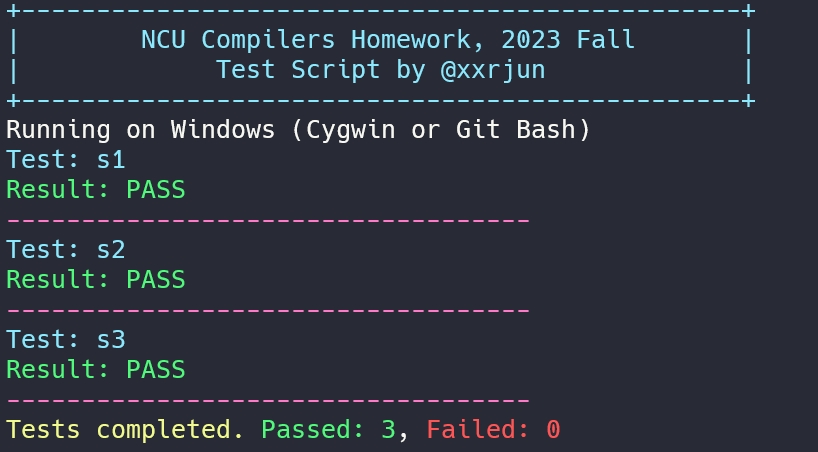
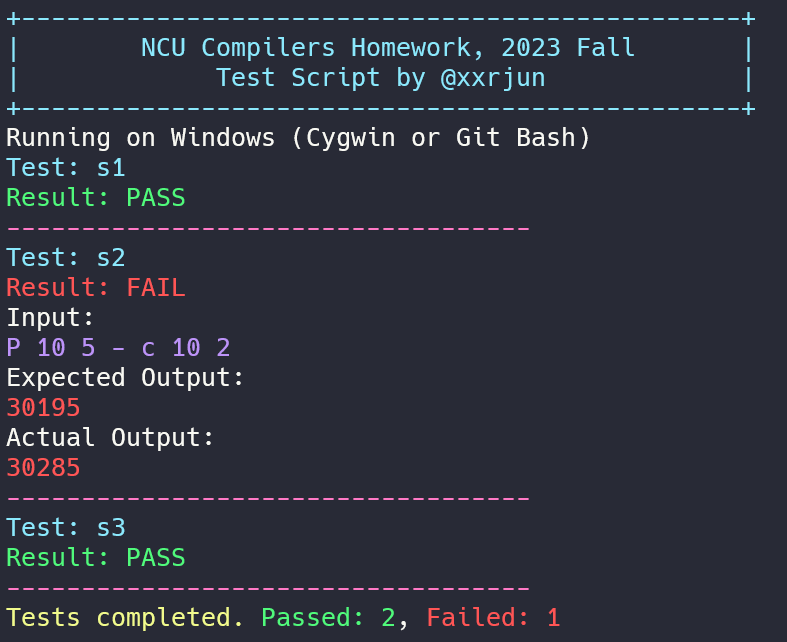
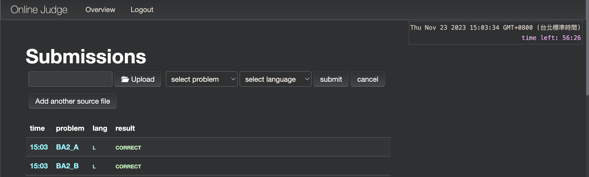
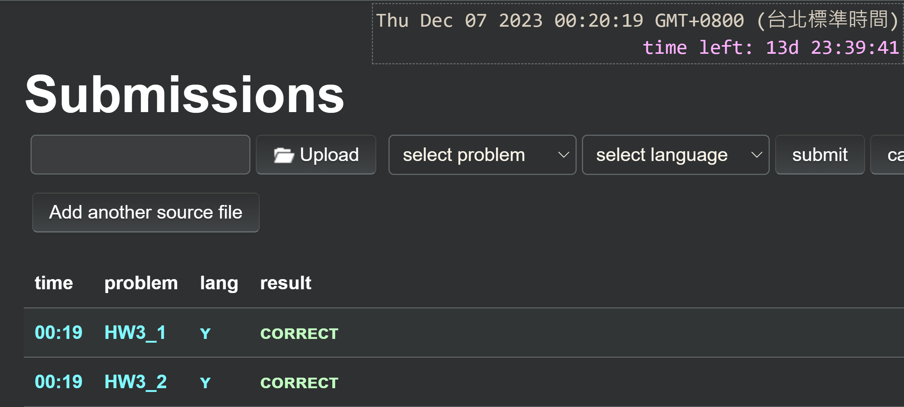

# NCU Compilers Fall 2023

- [Run Tests Scripts Template](#run-tests-scripts-template)
  - [Usage](#usage)
  - [Sample output](#sample-output)
- [C/C++ 指定版本指令](#cc-指定版本指令)
- [Lex 指令](#lex-指令)
- [Yacc \& Lex 指令](#yacc--lex-指令)
- [AC Screenshot](#ac-screenshot)


## Run Tests Scripts Template

此腳本會自動偵測作業系統，包含 Mac, Linux, Windows。此腳本會

1. 編譯與執行程式
2. 將程式輸出與測資輸出做比對
3. 顯示測資結果
4. 清空編譯產生的檔案

檔案 [run_tests_template.sh](./run_tests_template.sh)


### Usage

更新腳本權限

```bash
chmod +x ./run_tests_template.sh
```

更新執行程式名稱以及測資資料夾名稱

以以下檔案結構為例

```bash
|   matrix_calculator.l
|   matrix_calculator.y
|   run_tests.sh        # 測試腳本，主要使用這個即可
|   script.sh           # 編譯腳本
|
\---testcases           # 檔名是對應的，一個 .in 對一個 .out
        1.in
        1.out
        3.in
        3.out
        5.in
        5.out
        7.in
        7.out
```

```bash
TEST_DIR="./testcases" # TODO: Change this to your test directory
PROGRAM_NAME="program" # TODO: Change this to your program name
```

執行腳本

```bash
./run_tests_template.sh 
```

### Sample output

Sample output 1

<div >
    
</div>

Sample output 2

<div>
    
</div>

## C/C++ 指定版本指令

On Mac

```bash
g++ --std=c++11
```

On Windows

```bash
g++ --std=gnu++11
```

## Lex 指令

On M2 Mac (arm64)

```bash
lex -o lex.yy.c lex.l
gcc -o lex lex.yy.c -ll
```

On Windows

```bash
flex myLexProgram.l
bison -d myYaccProgram.y
gcc -o indent lex.yy.c
```

## Yacc & Lex 指令

On Mac

```bash
bison -d -o y.tab.c matrix_calculator.y
gcc -c -g -I.. y.tab.c
lex -o lex.yy.c matrix_calculator.l
gcc -c -g -I.. lex.yy.c
gcc -o matrix_calculator y.tab.o lex.yy.o -ll
```

On Windows

```bash
bison -d -o y.tab.c matrix_calculator.y
gcc -c -g -I.. y.tab.c
flex -o lex.yy.c matrix_calculator.l
gcc -c -g -I.. lex.yy.c
gcc -o matrix_calculator y.tab.o lex.yy.o -ll
```

How to deal with shift/reduce conflict? Use verbose mode to find out the problem.

```bash
bison -v matrix_calculator.y
```

It will generate a file called `matrix_calculator.output` which contains the verbose information.


## AC Screenshot

> 有些忘記截圖

BA2

- BA2 Second Question
- BA2 Book Information

<div>
    
</div>

HW3

- HW3-1 Stack Base Machine 
- HW3-2 Matrix Calculator

<div>
    
</div>

